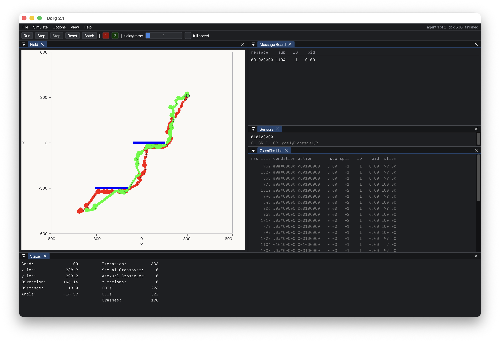

# Borg 2.1



## Summary

This is the code from my 1995 Master's thesis at Virginia Tech. See "DougGaff-Thesis.pdf" in this repro. That file is a scanned PDF from the Tech library, which is why it's a little fuzzy. Hopefully I'll be able to recreate the original from a very old Word doc.

Specifically, this code is a Learning Classifier System (LCS) and Distributed LCS (DLCS) simulator with an animat task environment for simulating robots navigating around obstacles and sharing learnings. The DLCS part of the thesis is my own novel work. The goal was to come up with a way to for robots to share learnings derived from each one of them running their own LCS.

The software was originally written in Borland C++ 4.02 for 16-bit Windows 3.1. It no longer runs on Windows for obvious reasons, and even if you had a 16-bit Windows 3.1 machine, you'd still need the Borland run-time libraries, which I failed to preserve in my code backup.

Rather that figure out how to run this on a modern Windows, I worked with Claude Opus 5 to build this on Mac. This was almost entirely porting the GUI portions over. The simulator code itself is unchanged materially from the 1995 code. Layers 1 and 2 — the classifier system and the task environment — are the original sources, changed only where a 16-bit Borland assumption no longer holds on a 64-bit Unix compiler. Every such change carries a `2026 PORT` comment at the point of edit. Layer 3, the Win16 +
BWCC user interface, could not be ported and was rebuilt; `UI.CPP`, `GRAPH.CPP`,
`BORG.CPP` and `BORG.RC` remain in the tree, unbuilt, as the preserved artifact.

The best part about this and reflective of Claude's brialliance is that the port reproduces the 1995 runs **bit-for-bit**: a configuration read out of a 1995 `.SIM` and re-run here lands on the same trajectory, float for float, as the file recorded in 1995. `borg legacy check` and `borg legacy replay` are what demonstrate that, and it is covered by the test suite. Among other things, this required reconstructing the random number generator with the same integer precision as the original.

See [CLAUDE.md](CLAUDE.md) for the architecture, the conventions, and the
reasoning behind the original design.

NOTE: I haven't tested every aspect of the GUI yet, e.g. I haven't tried tweaking a bunch of simulator parameters. As a first step, I just wanted to get the old code running again.

NOTE #2: There's a build #define called NETWORK in the code. It means "build the DLCS version" and it's the default. When I wrote this code initially, I wrote only the LCS implementation. That was Borg 1.0, and it's backed up separately outside of this repo. That work wasn't sufficient for my masters thesis, though, so I wrote version 2, which implemented DLCS. Most of the code was shared, but initiating the simulations was different. I kept the old LCS code path in, and implemented DLCS with the NETWORK build tag. I never retested the non-NETWORK build path in version 2, because I ended up implementing a way to call the simulator without animats sharing learnings, effectively turning the Distributed part off. So the old code path wasn't needed anymore. Anyway, Claude found a build error in the non-NETWORK build path, and we chose to fix it. Claude did retest that code path, but I haven't verified it.

## Requirements

| | |
|---|---|
| macOS | Apple Silicon or Intel; developed on Darwin 25 |
| Xcode command line tools | for `clang++` (C++17) |
| CMake | 3.20 or newer |
| SDL3 | `brew install sdl3` — **only** needed for the GUI |

Dear ImGui and `stb_image_write` are **vendored** in [gui/vendor/](gui/vendor/),
pinned and committed, so the GUI builds with no network access and no package
manager beyond SDL3. See [gui/vendor/PROVENANCE.md](gui/vendor/PROVENANCE.md) for
the exact upstream commits and the files taken.

## Build

```sh
cmake -S . -B build
cmake --build build -j8
```

That produces:

| Target | What it is |
|---|---|
| `build/borg` | headless command-line front end |
| `build/borg_gui.app` | the macOS GUI |
| `build/libborgcore.a` | Layers 1 + 2, DLCS build (`NETWORK` defined) |
| `build/libborgcore_plain.a` | Layers 1 + 2, plain-LCS build |

If SDL3 is not installed, CMake says so and **skips the GUI** — the CLI and every
test still build. To opt out deliberately:

```sh
cmake -S . -B build -DBORG_BUILD_GUI=OFF
```

### Run the tests

```sh
ctest --test-dir build --output-on-failure
```

Nine tests. They cover determinism against golden trajectory values (both
variants), the `.O` column layout against a surviving 1995 output file, the
16-bit legacy decoder against genuine 1995 artifacts, the `.RUL` round trip in
both variants plus a cross-variant byte comparison, and two end-to-end runs
through the CLI.

---

## Running the GUI

```sh
cd ~/where/you/want/output/to/land
/path/to/Borg21/build/borg_gui.app/Contents/MacOS/borg_gui
```

**Run it from a terminal, not from Finder.** `borg.ini`, `borg_layout.ini` and
the `.pos` files the simulator writes are all relative paths — `agent1.pos`,
`obst.pos` and `goal.pos` are hard-coded 8.3 names inside
`saveAgentPositions()`. Launched from Finder the working directory is `/`, which
is not writable. Launched from a terminal it is the terminal's directory, which
is almost certainly what you want.

### The window

It opens in the 1995 arrangement, reproduced from `calcDimensions` (`UI.CPP:1065`):

```
+-----------------------------------------------------+
| Run Step Stop Reset Batch | 1 2 ... 8   (Speed bar) |
+---------------------------+-------------------------+
| Environment   (square)    | Message Board     (40%) |
|  axes, goal, obstacles,   +-------------------------+
|  agent trails             | Sensors           (10%) |
|                           +-------------------------+
|                           | Classifier List  (rest) |
+---------------------------+-------------------------+
| Status  (2 columns x 30 chars, 13 lines)            |
+-----------------------------------------------------+
```

Unlike 1995, every panel docks: drag, resize, tab, or close it. **View ▸ Reset to
1995 Layout** puts it back. The layout persists in `borg_layout.ini`.

### Keyboard

| | | | |
|---|---|---|---|
| `Cmd+N` | New | `Cmd+R` | Run |
| `Cmd+O` | Open `.sim` | `Space` | Step one tick |
| `Cmd+S` | Save | `Cmd+.` | Stop |
| `Cmd+W` | File Walk | `Cmd+B` | Start batch |
| `Cmd+E` | Export field as PNG | `Cmd+Q` | Quit |

### Settings

Four non-modal windows under the **Settings** menu — Display, System, Agent,
Network — mirroring the four BWCC dialogs, with the same field groups and order.
Edits are buffered and applied on **OK**, which then performs a **full reset**,
exactly as 1995's `resetRequest = 1` did. This is not a UI preference: `softReset()`
performs no allocation, so list lengths, message length and agent count cannot
change between soft resets.

Parameters that CLAUDE.md documents as **NOT USED** are greyed out with a
tooltip: `numConditions`, `BBAstyle`, `TCOenabled`, bid tax, producer tax and
interval, and `eliteThresh`.

### File Walk — replaying the 1995 research data

**File ▸ Walk** points at a directory of numbered snapshots and plays them as an
animation, which is how the thesis figures were originally reviewed. Both 1995
modes are preserved:

- **`.SIM` mode** — loads `<N>.SIM` for N = start..end. A file that fails to load
  is *skipped*, not an error, which is how gaps in the numbering were tolerated.
- **`.P` mode** — loads `<series>_<num>.p`, counting `num` up within a series;
  when that file is missing the series advances and `num` restarts at 1.

The 16-bit 1995 originals can be walked directly. Pointing it at the thesis data
(`../../Research/BBA`, which holds `1.SIM`..`50.SIM` and `1_1.P`, `1_2.P`, …)
replays the real runs. `framesPerFile` is the one addition — a `.P` loads in
microseconds now, so an unthrottled walk would flash past.

As in 1995, your in-progress simulation is saved to a temp file before a walk or
a batch and restored afterwards.

### Figure export

**File ▸ Export Field as PNG** writes the environment panel at full Retina
resolution. This replaces two 1995 menu items with nothing to port them to:
*Save Meta File* (a `.WMF` recording of GDI calls) and `makeBitmap()` (a
hand-rolled `BITMAPINFO` written a byte at a time).

---

## Running headless

`build/borg` drives the same `borgcore` library with no window and no message
loop. This is the interesting path for new work: batch mode is how every result
in the thesis was produced, and the `.O` table it writes is what the MATLAB and
Excel post-processing reads.

```
borg batch <file.b> [-C dir] [-q]
borg run [-s seed] [-a agents] [-m maxticks] [-e standard|concave]
         [-r rules.RUL] [-o out.sim] [-p out.P] [-q]
borg info <file.sim>
borg pos  <file.P>

  -C dir   change to dir first, so N.sim and the .O land there
  -r file  load a rule list (.RUL) after reset, before running
  -p file  write the agent position history as a binary .P
  -q       quiet: no per-simulation progress on stdout
```

### One simulation

```sh
$ borg run -s 100 -m 2000
                    Number of   Sexual     Asexual    Number of  Number of  Number of  Number of
Sim #  Agent  Seed  Iterations  Crossover  Crossover  Mutations  CDO's      CEO's      Crashes

   0      1    100      636          0          0          0        226        322       198
   0      2    100      531          0          0          0        234        275       104

636 ticks
  agent 1 final position (288.90, 293.18) heading 0.805 rad
  agent 2 final position (304.69, 310.77) heading -0.628 rad
```

The columns are the `.O` columns, so console output and batch output are directly
comparable.

### A batch

```sh
borg batch sample.b -C results
```

Writes `results/sample.O` (the stats table) and one `results/<N>.sim` snapshot
per simulation, numbered from the first data line of the script.

### Reading the 1995 files

These need a separate path, because `int` was 2 bytes in 1995 and is 4 bytes now
— a 1995 `.SIM` read with today's `fread()` desynchronises on the very first
field. `host/legacy.cpp` walks the same field order the 1995 `save()` functions
wrote and re-emits it at native widths.

```
borg legacy info    <file.SIM|file.P> [--rules]
borg legacy convert <file.SIM|file.P> <out>
borg legacy csv     <file.SIM|file.P> [-o out.csv]
borg legacy check   <file.SIM> <file.P>
borg legacy replay  <file.SIM> [-r rules.RUL]
borg legacy rules   <file.RUL>
```

- **`info`** — decode and report every parameter, plus which layout won (DLCS or
  plain LCS; nothing in the file says which).
- **`convert`** — write a snapshot this build can load directly.
- **`csv`** — dump the trajectory as `agent,step,x,y,heading` for plotting.
- **`check`** — compare the two independently-written copies of a trajectory (the
  position block inside a `.SIM` against the separate `.P`).
- **`replay`** — re-run the 1995 configuration and report whether this build
  reproduces it.

```sh
$ borg legacy check 1.SIM 1_1.P
  agent 1: 24 positions and headings, every float identical
  AGREE -- 24 positions checked, bit-for-bit
```

---

## File formats

Every binary format is a raw `fwrite` of scalars, so **field order *is* the
format**. That makes them portable in field order but not in field width, which
is the whole reason the legacy reader exists.

### `.sim` — simulation snapshot (binary)

```
char[4]              version string, currently "2.1"
task.saveStatic()    shared static parameters
task.save()          per-agent instance state
```

Two things to know:

- **Not interchangeable between a DLCS and a plain-LCS build.** `#define NETWORK`
  adds fields to almost every record — agent IDs threaded through the classifier
  list, the message board, the network interface. To disable DLCS without
  changing the format, leave the define and set `networkEnabled` to 0.
- **Not interchangeable between 1995 and now.** A 1995 `.SIM` is 16-bit; use
  `borg legacy convert`. Both vintages begin `"2.1\0"`, so the GUI discriminates
  on the following 4-byte little-endian int — a modern file has a real message
  length of 1..4096 there, a 1995 file has `9 + 65536 × boardLen`.

### `.P` — agent position dump (binary)

Written by `saveAgentPosBinary()`. Per agent: a point count, then that many
`coord` + `float` pairs (position and heading).

**Loading a `.P` changes the live settings.** The second field is the maximum
number of positions a run could hold, so the loader derives `maxCount` from it,
pushes it through `classifierSystem::setSettings()`, and calls `reset()` — it is
not a read-only operation, and the 1995 GUI followed it with a full repaint for
exactly that reason.

A `.P` holds no version stamp and no statics, so it is the same shape in both
variants — and there is nothing in the file to identify its vintage. It also
*cannot fail to load*: `loadAgentPosBinary()` validates nothing, so a 1995 file
read natively would silently fill the trails with garbage. The GUI therefore
detects the vintage by arithmetic, walking the header chain at native widths and
checking whether the implied size equals the real file size.

### `.RUL` — rule list (plain text)

```
; Agent 1
100000000 001000001 10.000000
000000001 001100010 10.000000
```

One `; Agent N` header per agent, then one line per classifier: condition,
action, strength (`"%s %s %lf"`). Alleles are `0` / `1` / `#`.

Being ASCII, `.RUL` is the one format that **is** interchangeable — across 16-bit
and 64-bit, and across DLCS and plain LCS. That was not true until this port: the
`; Agent N` header was written only under `NETWORK` while `loadRules()` always
skipped a line, so a plain-LCS build could not reload a rule file it had just
written. It consumed the first rule as a header, shifted every rule up by one and
dropped the last — silently, since `loadRules()` checks nothing by design. Fixed
in Phase 4, and the fix is what makes the two variants byte-identical here.

### `.b` — batch script (plain text)

Lines beginning with `;` are comments. The first data line is the starting
simulation number. A line beginning with `*` ends the batch. Every other line is
one whitespace-separated simulation spec, parsed by a single `sscanf` (copied
verbatim from `UI.CPP:2367`) in three groups — system, agent, network. Booleans
are the literal characters `Y` / `N`.

**The field order in that `sscanf` is the entire specification; there is no
other.** The 42 columns, from the two `;` header lines of `SAMPLE.B`:

```
seed | num agents | env type | BBA on | soft reset | CDO on | CEO on |
elite on | elite thresh | head tax | max count | num class | msg to post |
gen int | bid const | init stren | stren cap | bid cap | xover prob |
mutate prob | goal reward | dir reward | obst reward | crash pen |
goal range | obst range | sensor range | time const | agent dia | net on |
class pass | class Tx int | class max Tx | class max Rx | Tx stren thresh |
Rx stren thresh | act pass | act Tx int | act max Tx | act max Rx |
Tx bid thresh | Rx bid thresh
```

`env type` is `0` = standard, `1` = concave. See
[tests/fixtures/sample.b](tests/fixtures/sample.b), a genuine 1995 script kept as
a test fixture.

### `.O` — batch output (fixed-column text)

Two header lines, a blank line, then one row per agent per completed run:

```
                    Number of   Sexual     Asexual    Number of  Number of  Number of  Number of
Sim #  Agent  Seed  Iterations  Crossover  Crossover  Mutations  CDO's      CEO's      Crashes

   1      1    100      636          0          0          0        226        322       198
```

The fixed columns are the format — the MATLAB and Excel post-processing reads
them by position — so the format string is copied character for character,
including the irregular run of spaces before the last column.
`tests/batch_format.cpp` regression-tests it against a surviving 1995 `.O`.

### `BORG.INI` — display preferences only

```ini
[display]
Environment=On
Info=On
Axes=On
Objects=Scaled
```

Hand-written reader matching 1995's `GetPrivateProfileString` defaults exactly,
including `Objects` defaulting to `Scaled`. `Objects=NotScaled` draws the agent
and obstacles at a fixed fraction of the field instead of to scale.

### `borg_layout.ini`

Dear ImGui's own window/dock layout state. Not a 1995 format; delete it to get
the default layout back, or use View ▸ Reset to 1995 Layout.

---

## Repository layout

| Path | |
|---|---|
| `*.CPP`, `*.H` (upper case) | the 1995 sources |
| `UI.CPP`, `GRAPH.CPP`, `BORG.CPP`, `BORG.RC` | Layer 3, 1995, **not built** |
| `BORG.EXE`, `BWCC.DLL`, `BC402RTL.DLL`, `BORG.IDE` | the 1995 build output and project |
| [compat/](compat/) | shims for what Borland provided: `except.h`, `values.h`, its `rand()` |
| [host/](host/) | platform-neutral code lifted out of Layer 3 — `.sim` I/O, the batch runner, the 16-bit legacy reader, the one error hook |
| [cli/](cli/) | the headless front end |
| [gui/](gui/) | Layer 3, rebuilt: Dear ImGui + SDL3 |
| [gui/vendor/](gui/vendor/) | pinned third-party sources, committed |
| [tests/](tests/) | guard tests and 1995 fixtures |

`host/` is not a second GUI. The simulation core has exactly **one** dependency
on its host — `hostDisplayError()` in [host/host.h](host/host.h) — and that is
deliberately the only one. In 1995 the global `error()` forwarded straight to
`UI.displayError`, and that single call was the entire Windows dependency below
Layer 3.

---

## Things worth knowing

**`getRandom()` counts its calls.** Reproducibility of a seeded run depends on the
exact *sequence* of random draws (`numRandCalls` in `CFS.H`), so reordering calls
changes results even when the logic is equivalent. The front end may choose when
and how many ticks to run — never what happens inside one. That is why the GUI's
speed control sets ticks per frame rather than touching the tick itself.

**Assume any `#else` branch in this codebase is broken until a compiler has seen
it.** `#define NETWORK` switches parallel *overloads*, not additions, so the
inactive branch is never parsed, never type-checked, never run. A real bug lived
in one for thirty-one years (the `.RUL` asymmetry above). That is why `borgcore`
is built **twice** — `borgcore_plain` with `BORG_NO_NETWORK` exists so those
branches get compiled, linked and exercised instead of merely existing. Turn it
off with `-DBORG_BUILD_PLAIN_LCS=OFF`.

Two more instances of the same pattern survive unbuilt in `UI.CPP`: `envSettings`
reads a `netOn` declared only `#ifdef NETWORK` and passes it to an overload with
no such parameter, and `displayClassifierList` prints an `elite` flag the plain
`getClassifier()` has no argument to fill.

**The 1995 files are CRLF and stay that way.** [.gitattributes](.gitattributes)
stores them with no end-of-line translation, because without it any tool that
rewrites one in text mode silently converts it to LF and every line shows up as
changed, burying the real edits. The vendored sources under `gui/vendor/` are
likewise stored byte-for-byte so `SHA256SUMS` stays verifiable against a fresh
upstream clone.

**Lower-case includes, upper-case filenames.** The sources write
`#include "cfs.h"` while the file on disk is `CFS.H` — DOS had no case. This
resolves on a case-insensitive APFS volume and the warning is suppressed. **On
Linux, or on a case-sensitive volume, it is a real failure.** Two ways out at
that point, neither taken: rewrite the include lines, or have CMake generate a
directory of lower-case symlinks and put it first on the include path.

**Probabilities have 2-decimal resolution.** Don't set one below 0.01
(`CLSSLIST.H`).

---

## Porting notes

| Phase | |
|---|---|
| 0–2 | Layers 1 + 2 compiling and running on clang; `compat/` shims; the `hostDisplayError` seam; the determinism guard |
| 3 | `.sim` I/O and the batch runner lifted out of `UI.CPP` into `host/`; the headless CLI |
| 4 | the 16-bit reader for the genuine 1995 `.SIM` / `.P` / `.RUL` files, and the `.RUL` header fix |
| 5 | Layer 3 rebuilt on Dear ImGui + SDL3 |

Phase 5 changed **no 1995 source file at all** — `git diff --stat` over them is
empty. Every number on screen comes from a getter that already existed in 1995
for the sole purpose of feeding `UI.CPP`. The layer separation in the original
design is what made the GUI a re-skin rather than a rewrite.

The one silent killer found along the way, for anyone attempting this again:
`getRandom()` computed `RAND_MAX + 1`, which overflowed to 0 on a 16-bit `int`
and happened to do the right thing; on a modern compiler it does not, and all
randomness dies quietly rather than loudly.
